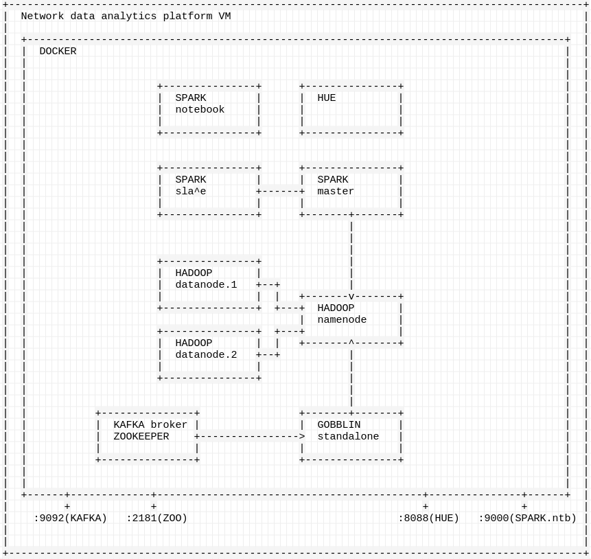
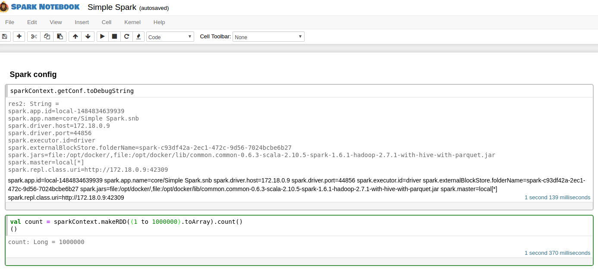
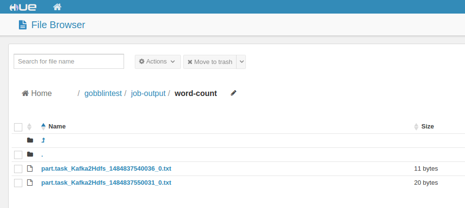

# Local development with PNDA
This blog outlines an approach for developing applications on top of a locally deployed "PNDA like" platform. It is especially useful for local development and initial testing. Without having to dedicate resources for a full-blown PNDA deployment.

"PNDA like" means that a subset of tools that are used in PNDA are deployed in a single VM as docker containers.

The tools used are:
* Kafka
* Gobblin
* Hadoop
* Spark
* Spark notebook
* HUE - hadoop file browser

## VM setup for PNDA
An "empty" VM is needed initially to host docker and all the containers. In our setup we were using Virtualbox (5.1.12), where we created a VM with:
* Ubuntu 16.04 server
* 2 cores
* 5 Gb of RAM
* 30 Gb of disk space
* 2 network interfaces
  * NAT interface for internet access
  * Internal interface to access other VMs

### Install docker
After there's a VM up and running proceed with docker installation according to the [official guide](https://docs.docker.com/engine/installation/linux/ubuntulinux/).

Verifying the docker engine installation:
```bash
$ docker --version
Docker version 1.13.0, build 49bf474
```
Then proceed with installation of docker-compose tool according to the [official guide](https://docs.docker.com/compose/install/). It is used to deploy all of the containers defined in docker-compose.yml.

```bash
mmarsalek@nda:~$ docker-compose --version
docker-compose version 1.10.0, build 4bd6f1a
```
### Deploy the platform
Now the platform itself can be deployed, so proceed with ```git clone``` of the required configuration files from [TODO add URL](). The repository contains:
* docker-compose definition file,
* gobblin job definition (to transfer data from kafka to hadoop)
* hadoop configuration
* "add worker nodes to spark" script
* and this guide

Note: The deployment scripts build on https://github.com/big-data-europe/docker-hadoop-spark-workbench. The differences are:
* different version of Spark notebook
* kafka container
* gobblin conteiner

So now go to the new folder and in the new folder run:
```bash
sudo docker network create hadoop
sudo docker-compose up -d
```
It will take a while before docker pulls all the images, but after it does, you should see the following output:
```bash
Creating datanode1
Creating kafka
Creating spark-master
Creating datanode2
Creating sparknotebook
Creating hdfsfb
Creating namenode
Creating pndadocker_spark-worker_1
Creating gobblin
```

Checking the output of ```sudo docker ps``` should list the following (meaning that all the containers were deployed successfully):
```
$ sudo docker ps
CONTAINER ID        IMAGE                                                                                            COMMAND                  CREATED             STATUS              PORTS                                                      NAMES
83793f4e1ea9        gobblin/gobblin-standalone:ubuntu-gobblin-latest                                                 "java -cp /opt/gob..."   41 seconds ago      Up 40 seconds                                                                  gobblin
eff5d4841fe8        earthquakesan/hadoop-spark-worker:1.0.0                                                          "/spark-worker-ent..."   49 seconds ago      Up 42 seconds                                                                  pndadocker_spark-worker_1
73f4ffb03f40        bde2020/hadoop-namenode:1.0.0                                                                    "/entrypoint.sh /r..."   49 seconds ago      Up 43 seconds       0.0.0.0:8020->8020/tcp, 0.0.0.0:50070->50070/tcp           namenode
33f50e97c6a6        andypetrella/spark-notebook:0.6.3-scala-2.10.5-spark-1.6.1-hadoop-2.7.1-with-hive-with-parquet   "bin/spark-notebook"     49 seconds ago      Up 42 seconds       0.0.0.0:4040->4040/tcp, 0.0.0.0:9000->9000/tcp, 9443/tcp   sparknotebook
304c1db3fb42        bde2020/hdfs-filebrowser:3.9                                                                     "/entrypoint.sh bu..."   49 seconds ago      Up 41 seconds       0.0.0.0:8088->8088/tcp                                     hdfsfb
aa6d85af1ca2        bde2020/hadoop-datanode:1.0.0                                                                    "/entrypoint.sh /r..."   49 seconds ago      Up 44 seconds                                                                  datanode2
bea3b0737088        earthquakesan/hadoop-spark-master:1.0.0                                                          "/spark-master-ent..."   49 seconds ago      Up 43 seconds       0.0.0.0:7077->7077/tcp, 0.0.0.0:8080->8080/tcp             spark-master
771b3627f5e3        spotify/kafka                                                                                    "supervisord -n"         49 seconds ago      Up 43 seconds       0.0.0.0:2181->2181/tcp, 0.0.0.0:9092->9092/tcp             kafka
0aa2b63353bf        bde2020/hadoop-datanode:1.0.0                                                                    "/entrypoint.sh /r..."   49 seconds ago      Up 42 seconds                                                                  datanode1

```

This diagram outlines the architecture of the platform:



And these are the versions of the main components in use:
* Kafka - 2.11-0.10.1.0
* Gobblin - 0.8.0
* Hadoop - 2.7.1
* Spark - 1.6.1 (Scala 2.10)
* Spark notebook - 0.6.3-scala-2.10.5-spark-1.6.1-hadoop-2.7.1-with-hive-with-parquet
* HUE -3.9

### Verifying the platform
To verify that platform was successfully deployed, visit these URLs:
* ```http://<VM.IP>:9000``` - Spark notebook
* ```http://<VM.IP>:8088/home``` - HUE browser (login with e.g. hue/admin)
* ```http://<VM.IP>:8080``` - Spark master

## Running applications

The platform is now up and running and can be used for application development.

### Spark notebook intro

Spark notebook is a UI application that enables easy prototyping for big data applications. It is similar to Jupyter notebook used in the real PNDA platform.

Go to ```http://<VM.IP>:9000``` to access Spark notebook UI. It already contains a couple of default notebooks which can be run right away. Open ```core/Simple Spark``` notebook and run (by hitting the "Play" button) the first 2 cells:



A Spark application has just been executed.
However it was isolated only to the Spark notebook docker container since by default, notebooks are run on a local deployment of spark (local to the node where notebook is installed). In order to run the application on top of Spark deployed in our platform, the settings for notebook need to change. In the Simple Spark notebook hit ```Edit > Edit notebook metadata``` and replace the ```"customSparkConf": null,``` line with:

```json
"customSparkConf": {
  "spark.app.name": "Test",
  "spark.master": "spark://spark-master:7077",
  "spark.executor.memory": "1G"
},
```

Save the metadata, restart the kernel (by hitting the "stop" button and then the "refresh" button) and rerun the first 2 cells. You can verify that you are running on top of the "Spark cluster" by visiting ```http://<VM.IP>:8080``` and seeing an application listed there with name ```core/Simple Spark.snb```. Further details about the application are exposed at ```http://<VM.IP>:4040/jobs/```.

## Collecting data with Kafka

Kafka and Gobblin are both part of the real PNDA and are also present in this lightweight deployment.

In an arbitrary second linux VM (second VM is not needed as this could be done in the VM hosting PNDA, but we deployed the second one to feed the data into Kafka from) download kafka according to [their official guide](https://kafka.apache.org/quickstart). Note that the same version that's used by PNDA should be used: 2.11-0.10.1.0 to prevent any unexpected issues.

After unpacking kafka (no need to actually start it), run a simple console producer:
```bash
<path_to_unpacked_kafka>/bin/kafka-console-producer.sh --broker-list <VM.IP>:9092 --topic word-count
```
and write a couple words into it:
```
Hello world
from kafka to hadoop
```

If you were to open a consumer with:
```bash
<path_to_unpacked_kafka>/bin/kafka-console-consumer.sh --zookeeper <VM.IP>:2181 --topic word-count
```
and wrote some additional messages in the producer, you would see them appear in the consumer window. You would be communicating over kafka deployed inside our platform.

With Gobblin set up, you should be able to view the content submitted to kafka in HDFS by opening ```http://<VM.IP>:8088/filebrowser/view/gobblintest/#/gobblintest/job-output/word-count```:



those files contain all of the messages submitted to kafka from your producer thanks to Gobblin.

Note: Gobblin job configuration (to consume kafka and store in HDFS) is part of the original git repo under the gobblin folder. You can at this point also check the logs from gobblin inside the same folder.

## Putting it all together

After having Spark notebook ready as well as the data collection part, we can write a simple word count application.

Head back to Simple Spark notebook from before and hit the plus symbol to add another cell and put the following code there:
```scala
// Load the content into an RDD
val sources = sc.textFile("hdfs://namenode:8020/gobblintest/job-output/word-count")
// Transform the RDD into individual words and collect their count
sources.flatMap(line => line.split(" ")).count()
```
By executing this code, you will load all the files containing content from kafka's word-count topic and count the number of them on top of our "spark cluster":


This executed an application in Spark cluster, which loaded data from HDFS, which were collected from kafka. Therefore verifying the platform end-to-end.

## Conclusion
This blog showed how to quickly and locally set up a platform similar to PNDA for initial testing and development. It is obviously not suitable for production environments at this stage.

Note: If local application prototyping with small amounts of data is your goal, feel free to deploy Spark notebook locally and use local files in a single VM. No need to follow this setup. The goal here is to deploy something between a full PNDA deployment and running just a local notebook.

### Further reading
* [Spark programming guide](http://spark.apache.org/docs/latest/programming-guide.html)
* [Spark notebook guide](https://github.com/andypetrella/spark-notebook/blob/master/docs/index.md)
* [PNDA offical documentaion](http://pnda.io/guide)

### Further improvements to this tutorial
* Deploy kafka in a clustered way instead of a single node
* Deploy gobblin on top of hadoop in clustered way instead of a standalone deployment
* Put VM creation in a vagrant script or something similar
* Replace Spark notebook with Jupyter
* Add spark streaming from kafka example app
* Add standalone spark app deployment to spark master example

## Resources
Resources used as inspiration for this setup:
* [Hadoop, Spark and Spark notebook in docker](https://www.big-data-europe.eu/scalable-sparkhdfs-workbench-using-docker/)
* [Kafka and Spark streaming in docker](http://blog.antlypls.com/blog/2015/10/05/getting-started-with-spark-streaming-using-docker/)
* [Gobblin Kafka and HDFS](http://gobblin.readthedocs.io/en/latest/case-studies/Kafka-HDFS-Ingestion/)
